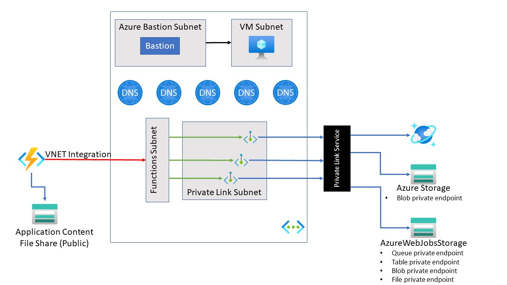

# Connect to private endpoints with Azure Functions

<!-- 
Guidelines on README format: https://review.docs.microsoft.com/help/onboard/admin/samples/concepts/readme-template?branch=master

Guidance on onboarding samples to docs.microsoft.com/samples: https://review.docs.microsoft.com/help/onboard/admin/samples/process/onboarding?branch=master

Taxonomies for products and languages: https://review.docs.microsoft.com/new-hope/information-architecture/metadata/taxonomies?branch=master
-->

This sample shows how to use Azure Functions with other Azure resources using a private endpoint connection.  The sample uses an [Azure Functions Premium plan](https://docs.microsoft.com/azure/azure-functions/functions-premium-plan) with [regional VNet Integration](https://docs.microsoft.com/azure/azure-functions/functions-networking-options#regional-virtual-network-integration) to interact with Azure resources confined to a virtual network.

## Prerequisites

The following components are required to run this sample:

- [.NET Core 3.1](https://dotnet.microsoft.com/download/dotnet-core/3.1)
- [Visual Studio Code](https://code.visualstudio.com/)
- [Azure CLI](https://docs.microsoft.com/cli/azure/install-azure-cli?view=azure-cli-latest)
- [Azure Functions Core Tools](https://docs.microsoft.com/azure/azure-functions/functions-run-local)
- [Azure subscription](https://azure.microsoft.com/free/)

Optionally, you can use the [Azure Cosmos Emulator](https://docs.microsoft.com/azure/cosmos-db/local-emulator) if you wish to develop locally.

## Setup

1. Clone or download this sample repository.
2. After cloning the repository, edit the `deploy.sh` script (in the `template` folder) to include your Azure subscription ID.

    ```azurecli
    az account set -s [YOUR-SUBSCRIPTION-ID]
    ```

3. Execute the `deploy.sh` script to deploy the sample to your Azure subscription.
4. Once all the Azure resources are deployed (which can take about 10-12 minutes), you will need to deploy the Azure Function to the newly created Azure Function app. You can use the [Azure Functions Core Tools to deploy the function](https://docs.microsoft.com/azure/azure-functions/functions-run-local?tabs=windows%2Ccsharp%2Cbash#publish).

    ```azurecli
    func azure functionapp publish [YOUR-FUNCTION-APP-NAME]
    ```

## Deploy to Azure

[](https://portal.azure.com/#create/Microsoft.Template/uri/)

## Running the sample

Please perform the following steps to run the sample.

1. Connect to the newly created VM using Azure Bastion
2. Copy the `sample.csv` file to the newly created VM
3. From the VM, use a web browser to open the Azure portal.
4. Navigate to the newly created storage account which starts with `widgets`, and using Storage Explorer in the portal, upload the `sample.csv` file to the `orders` blob storage container.
5. Within a few seconds, the function's blog trigger should execute and process the file.
6. Navigate to newly created CosmosDB resource.  Using Data Explorer in the portal, open the `Widgets` database and `Orders` collection. You should notice the same number of documents in the CosmosDB collection as were in the sample CSV file.

## Key concepts

This sample demonstrates how to configure an Azure Function to work with Azure resources using private endpoints. By using private endpoints, the designated resources are accessible only via the virtual network.

The sample sets up the following Azure resources:

- Azure Function with blob trigger and CosmosDB output binding
- Azure Function Premium plan with Virtual Network (VNet) Integration enabled
- Virtual network
- Configuring private endpoints for Azure resources
  - Azure Storage private endpoints
  - Azure Cosmos DB private endpoint
- Private Azure DNS zones
- Azure VM and Azure Bastion in order to access Azure resources within the virtual network.

### High level architecture

The diagram provide shows a high-level depiction of the sample architecture.



### Storage accounts

Azure Functions [requires the use of a general-purpose storage account](https://docs.microsoft.com/azure/azure-functions/storage-considerations#storage-account-requirements).  This sample uses two storage accounts to meet that requirement.

- The storage account referenced by the [AzureWebJobsStorage](https://docs.microsoft.com/azure/azure-functions/functions-app-settings#azurewebjobsstorage) application setting is configured with a private endpoint.
- The storage account referenced by the [WEBSITE_CONTENTAZUREFILECONNECTIONSTRING](https://docs.microsoft.com/azure/azure-functions/functions-app-settings#website_contentazurefileconnectionstring) does not use a private endpoint.

### Access resources with VNet restrictions

The sample provisions nearly all Azure resources within the confines of a virtual network.  Attempts to access the following resources will only succeed from within the VM (which is itself within the virtual network) due to the virtual network restrictions on the resources:

- Storage accounts
  - `widgets` + unique string (e.g. widgetspmobtiatsqdgc)
  - `fnapp` + unique string + `wjsa` (e.g.fnapppmobtiatsqdgcwjsa)
- CosmosDB
  - `widgets` + unique string (e.g. widgetspmobtiatsqdgc)

There are no virtual network restrictions on the following resources, and thus access to these resources is permitted from outside the virtual network (e.g. your desktop):

- Storage accounts
  - `fnapp` + unique string (e.g. fnapppmobtiatsqdgcac)
  - `vmdiag` + unique string (e.g. vmdiagpmobtiatsqdgc)

## Contents

Outline the file contents of the repository. It helps users navigate the codebase, build configuration and any related assets.

| File/folder       | Description                                |
|-------------------|--------------------------------------------|
| `.vscode`         | VS Code related settings.                  |
| `src`             | Sample source code.                        |
| `src\MyFunctions.cs`             | Azure Function sample code.                        |
| `src\sample.csv`             | Sample CSV file.                        |
| `template`        | Azure Resource Manager template and deployment script. |
| `template\azuredeploy.json` | Azure Resource Manager template for provisioning Azure resources. |
| `template\azuredeploy.parameters.json` | Parameters used by the Azure Resource Manager template. |
| `template\deploy.sh` | Script to deploy the template. |
| `.gitignore`      | Define what to ignore at commit time.      |
| `CHANGELOG.md`    | List of changes to the sample.             |
| `CONTRIBUTING.md` | Guidelines for contributing to the sample. |
| `README.md`       | This README file.                          |
| `LICENSE`         | The license for the sample.                |

## Contributing

This project welcomes contributions and suggestions.  Most contributions require you to agree to a
Contributor License Agreement (CLA) declaring that you have the right to, and actually do, grant us
the rights to use your contribution. For details, visit [https://cla.opensource.microsoft.com](https://cla.opensource.microsoft.com).

When you submit a pull request, a CLA bot will automatically determine whether you need to provide
a CLA and decorate the PR appropriately (e.g., status check, comment). Simply follow the instructions
provided by the bot. You will only need to do this once across all repos using our CLA.

This project has adopted the [Microsoft Open Source Code of Conduct](https://opensource.microsoft.com/codeofconduct/).
For more information see the [Code of Conduct FAQ](https://opensource.microsoft.com/codeofconduct/faq/) or
contact [opencode@microsoft.com](mailto:opencode@microsoft.com) with any additional questions or comments.
